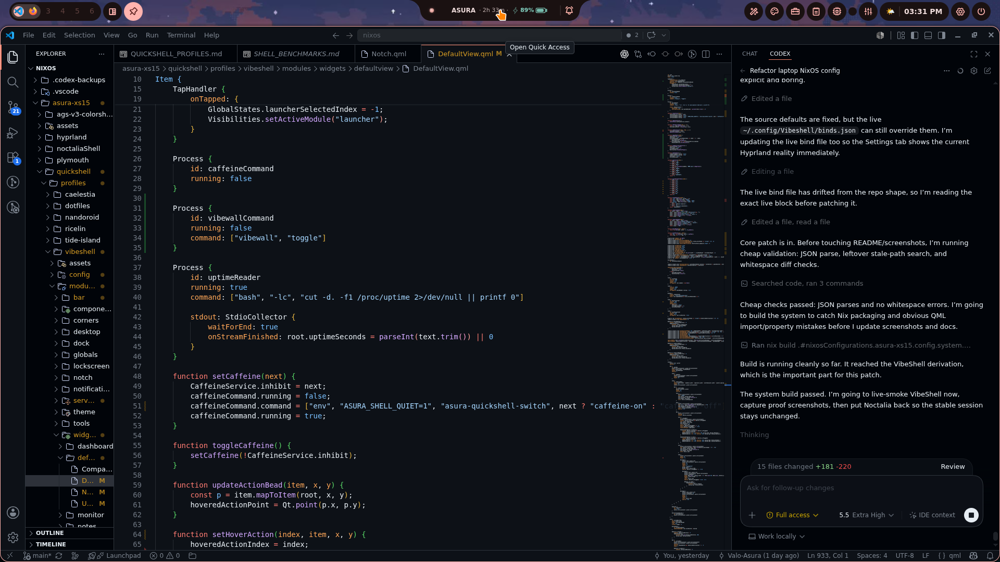
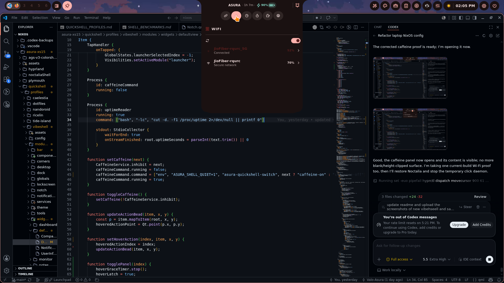
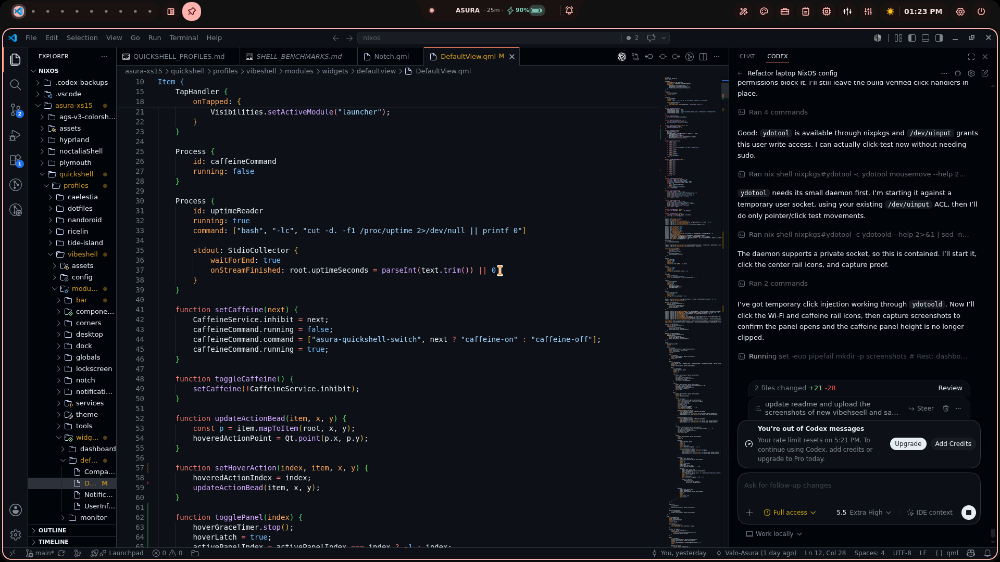
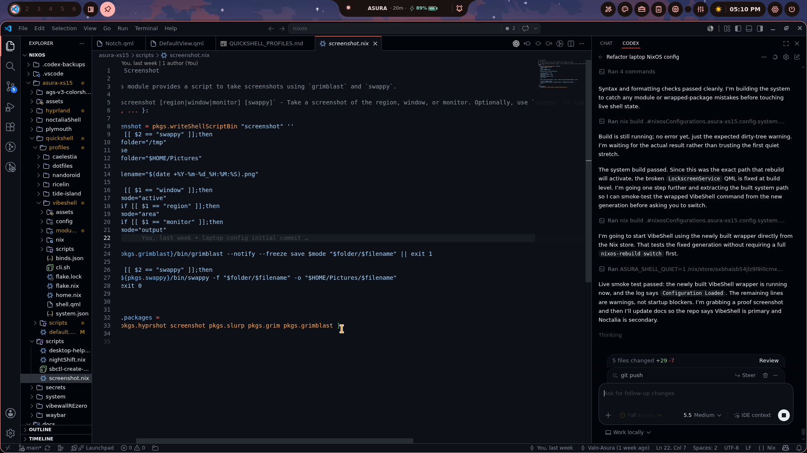
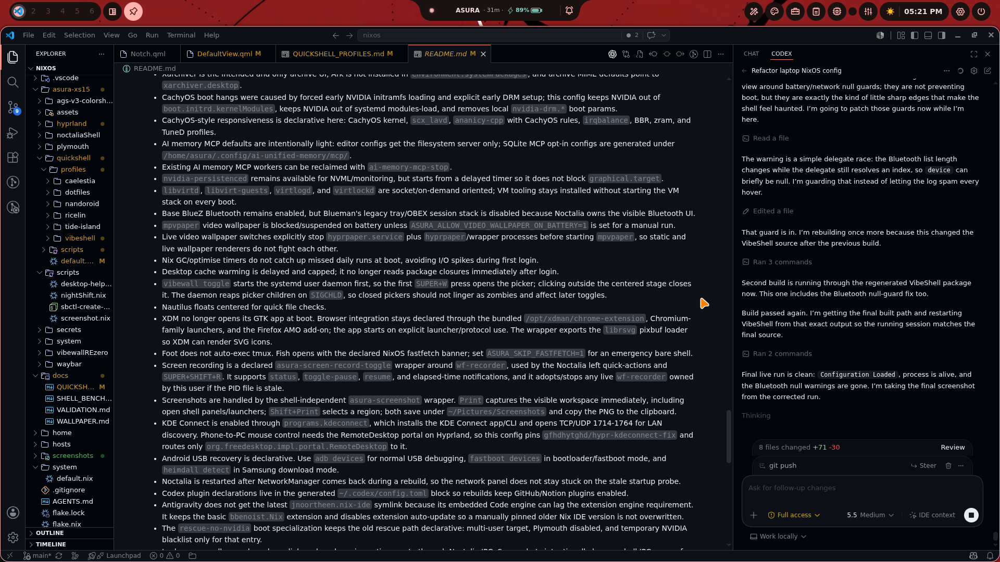

# Asura NixOS Singular Flake

> [!WARNING]
> Unified `/etc/nixos` flake for the active `asura-xs15` laptop and a future
> `asura-pc` host. The current implementation is laptop-first and uses shared
> desktop/shell modules with per-host overrides.

## Showcase

| Desktop Workspace | Lockscreen | Vibewall Grid |
| :--- | :--- | :--- |
|  |  |  |

| Vibewall Slice | Vibewall Hex | More/ehh image |
| :--- | :--- | :--- |
|  |  |  |

| Vibewall Mosaic | Wallhaven Browser |
| :--- | :--- |
|  |  |

| Transparent Active Workspace Overlay |
| :--- |
|  |

| VibeShell WIP Rail | VibeShell Wi-Fi Panel | VibeShell No-Dashboard Rail |
| :--- | :--- | :--- |
|  |  |  |

| VibeShell Live Boot Fix | VibeShell Final Live Check |
| :--- | :--- |
|  |  |

## Install

```bash
sudo git clone https://github.com/Valo-Asura/nixos-singular-PC-laptop.git /etc/nixos
cd /etc/nixos
sudo nixos-generate-config --show-hardware-config > /etc/nixos/hosts/asura-xs15/hardware-configuration.nix
sudo nixos-rebuild switch --flake /etc/nixos#asura-xs15
```

## Key Configurations

| Area | Current setup |
|---|---|
| Host | `asura-xs15` |
| Desktop | Hyprland `v0.55.3` from the official Hyprland flake plus VibeShell as the default shell |
| Secondary shells | Only `noctalia` and `waybar` remain alongside the shared default `vibeshell`; shell switching is handled by `asura-shell-switch` |
| Lockscreen | Hyprlock via `vibeshell-safe-lock`, using `screenshots/lockscreen.png`; |
| File manager | Nautilus default, PCManFM-Qt available, admin launchers/scripts, Xarchiver as the only archive UI |
| Theme | Dark GTK/libadwaita settings, Papirus-Dark icons, Bibata Modern Amber cursor at 24 px |
| Wallpaper | Shared `skwd-wall` backend; `vibewallREzero` is retained only as a disabled source package |
| Fan control | NBFC-Linux `0.5.2` plus NBFC-GTK `0.4.1` |
| Fan profile | Declarative two-fan `Colorful X15 AT 22` config with `MaxSpeedValue = 255`, max-sensor ramping, and emergency thermal guard |
| Plymouth | Host-local `circle_hud` theme from `hosts/asura-xs15/plymouth/circle_hud` |
| Kernel | CachyOS `7.1.0` from `nix-cachyos-kernel/release` |
| Boot GPU policy | Intel `i915` loads in initrd; NVIDIA stays out of initrd/modules-load and explicit `nvidia-drm.*` boot params |
| Performance | CachyOS kernel, `scx_lavd`, `ananicy-cpp` CachyOS rules, BBR, zram, irqbalance, delayed NVIDIA persistenced/cache warm, socket-only VM stack |
| Power | `thermald` plus `tuned`; TLP disabled |
| Downloads | Xtreme Download Manager GTK `8.0.29` pre-release with SVG pixbuf loader fix, user bridge, Firefox add-on, Chromium helper, and `xdm-app:` handlers |
| Phone link | KDE Connect `kdeconnect-kde`; `kdeconnectd` starts with Hyprland, firewall discovery ports are opened by the NixOS module, and `hypr-kdeconnect-fix` routes RemoteDesktop input for phone-to-laptop mouse/keyboard control |
| Android recovery | `android-tools` (`adb`, `fastboot`, `logcat`), `heimdall` for Samsung download-mode recovery, `scrcpy`, and MTP mount helpers; USB access is handled by systemd uaccess |
| AI memory | Shared root at `/home/asura/.config/ai-unified-memory`; filesystem MCP is default, SQLite MCP is opt-in/lazy, facts are system-only |
| Codex | Declarative `pkgs.codex` plus generated GitHub/Notion plugin config after rebuild |

## Daily Commands

```bash
rebuild                       # fish alias for sudo nixos-rebuild switch --flake /etc/nixos#asura-xs15
nbfc-colorful-verify          # verify selected NBFC config, fan count, and registers
thermal-status                # temperatures, tuned/thermald/NBFC state
nbfc-gtk --fans               # launch GTK fan control UI
systemd-analyze blame         # inspect boot/app-start blockers
asura-dark-mode-refresh       # reapply GTK/libadwaita dark settings in the active session
vibewall scan                 # index /home/asura/Wallpaper images/videos and build thumbnails
vibewall toggle               # open/close the native picker used by SUPER+W
vibewall apply FILE           # apply an image via Noctalia or a video via mpvpaper
vibewall restore              # restore last wallpaper on Hyprland login
vibewall wallhaven search "anime landscape" --page 1
vibewall picker --wallhaven   # open cached Wallhaven browser directly
ai-memory-mcp-status          # show live AI memory MCP processes/RSS
ai-memory-mcp-stop            # stop current AI memory MCP workers
asura-ai-memory paths         # print shared memory + opt-in MCP config paths
asura-video-wallpaper-stop    # stop mpvpaper and clear video wallpaper state
xdman                         # launch Xtreme Download Manager; launcher uses the same wrapper
xarchiver ARCHIVE             # open archives; Nautilus/PCManFM-Qt route archive MIME here
asura-screen-record-toggle    # toggle wf-recorder into ~/Videos/Screenrecords
asura-screen-record-toggle status
asura-screen-record-toggle toggle-pause
asura-screenshot full         # shell-independent screenshot for Print/features
asura-screenshot region       # region screenshot; also copies to clipboard
asura-shell-switch current      # print active shell from hosts/asura-xs15/shell/active-shell.nix
asura-shell-switch autostart    # start the configured shell
asura-shell-switch vibeshell    # start shared default VibeShell
asura-shell-switch noctalia     # start shared Noctalia
asura-shell-switch waybar       # start shared Waybar
asura-shell-launcher          # profile-aware launcher used by bare Super
asura-shell-launcher /tools   # quick actions/toolbox route used by SUPER+A
asura-vibeshell run launcher  # VibeShell launcher surface
asura-vibeshell run config    # VibeShell settings surface
asura-vibeshell run powermenu # VibeShell power island
vibeshell-safe-lock           # Hyprlock-backed shared lock command
kdeconnect-app                # pair with phone; install KDE Connect on the S24 too
kdeconnect-cli --list-devices # verify phone discovery/pairing from terminal
hypr-kdeconnect-portal --self-test-motion 120 0 # verify laptop pointer injection after login
adb devices                   # verify Android USB debugging/recovery access
fastboot devices              # verify bootloader/fastboot mode when a device is in that mode
heimdall detect               # verify Samsung download-mode detection
scrcpy                        # mirror/control Android over adb
ASURA_SKIP_FASTFETCH=1 foot   # skip the automatic fastfetch banner for one terminal
```

## Repository Structure

```text
/etc/nixos
├── hosts/                  # Host declarations; xs15 active, pc placeholder
├── modules/                # Shared NixOS modules and desktop/shell wiring
├── home/                   # Shared Home Manager modules and host overrides
├── shells/                 # Shared Noctalia, VibeShell, Walker, Waybar configs
├── packages/               # Local package adapters and disabled future sources
├── assets/                 # Shared visual/theme assets
├── docs/                   # Validation and workflow docs
└── screenshots/            # README screenshots
```

Rule: shared modules live under `modules/`, laptop-only modules live under
`hosts/asura-xs15/`, and shell configs live under `shells/`.

## Docs

| Document | Purpose |
|---|---|
| [`docs/VALIDATION.md`](docs/VALIDATION.md) | Rebuild, fan, theme, and repo safety checks |
| [`STRUCTURE.md`](STRUCTURE.md) | Current shared vs host-specific repo layout |

## Previous Config References

The CachyOS backup originally used for this cleanup was expected at:

```text
/home/asura/Downloads/colorfullxs15Previous
```

On 2026-06-12 that path was not present locally, so the current tuning is based
on the durable CachyOS findings already captured in shared system memory plus
live `systemd-analyze` data from this NixOS boot.

Current measured comparison on 2026-06-13:

| Area | CachyOS target behavior | Current NixOS state |
|---|---|---|
| Kernel/scheduler | Cachy kernel plus sched-ext responsiveness | CachyOS kernel `7.1.0`, `scx_lavd`, `ananicy-cpp` CachyOS rules |
| GUI boot blocker | No early NVIDIA initramfs load on hybrid laptop | Intel `i915` only in initrd; NVIDIA delayed, not gating `graphical.target` |
| Userspace boot | Fast graphical handoff | `graphical.target` reached in about `3.6s` userspace; firmware dominates total boot |
| Runtime helpers | Avoid always-running unused services | AI memory SQLite MCP lazy, Blueman off, libvirt/libvirt-guests socket/on-demand |
| Video wallpaper | Keep optional because it costs RAM/CPU | `mpvpaper` measured about `98 MiB RSS` and `6.7% CPU`; battery guard suspends it |
| Wallpaper picker | Tiny daemon, short-lived UI | daemon about `5.2 MiB RSS`; picker about `250 MiB RSS` only while open |

Important carry-overs:

- Colorful XS 22 / X15 XS hardware naming.
- NBFC profile `Colorful X15 AT 22`.
- True fan max is 8-bit `255`, not `100`.
- GPU fan registers are read `208`, write `232`.
- NBFC must use the hottest CPU/GPU sensor (`TemperatureAlgorithmType = Max`)
  so short Alder Lake spikes ramp fans instead of being hidden by averaged
  sensors.
- Live fan testing confirmed CPU reaches `100%` target. GPU accepts `100%`
  target, but its current-speed readback can stay negative/low on this EC, so
  use target speed plus airflow/noise for manual GPU fan confirmation.
- Nautilus is the intended file manager.
- Xarchiver is the intended and only archive UI; Ark is not installed in
  `environment.systemPackages`, and archive MIME defaults point to
  `xarchiver.desktop`.
- CachyOS boot hangs were caused by forced early NVIDIA initramfs loading and
  explicit early DRM setup; this config keeps NVIDIA out of
  `boot.initrd.kernelModules`, keeps NVIDIA out of systemd modules-load, and
  removes local `nvidia-drm.*` boot params.
- CachyOS-style responsiveness is declarative here: CachyOS kernel,
  `scx_lavd`, `ananicy-cpp` with CachyOS rules, `irqbalance`, BBR, zram, and
  TuneD profiles.
- AI memory MCP defaults are intentionally light: editor configs get the
  filesystem server only; SQLite MCP opt-in configs are generated under
  `/home/asura/.config/ai-unified-memory/mcp/`.
- Existing AI memory MCP workers can be reclaimed with `ai-memory-mcp-stop`.
- `nvidia-persistenced` remains available for NVML/monitoring, but starts from
  a delayed timer so it does not block `graphical.target`.
- `libvirtd`, `libvirt-guests`, `virtlogd`, and `virtlockd` are socket/on-demand
  oriented; VM tooling stays installed without starting the VM stack on every
  boot.
- Base BlueZ Bluetooth remains enabled, but Blueman's legacy tray/OBEX session
  stack is disabled because Noctalia owns the visible Bluetooth UI.
- `mpvpaper` video wallpaper is blocked/suspended on battery unless
  `ASURA_ALLOW_VIDEO_WALLPAPER_ON_BATTERY=1` is set for a manual run.
- Live video wallpaper switches explicitly stop `hyprpaper.service` plus
  `hyprpaper`/wrapper processes before starting `mpvpaper`, so static and live
  wallpaper renderers do not fight each other.
- Nix GC/optimise timers do not catch up missed daily runs at boot, avoiding
  I/O spikes during first login.
- Desktop cache warming is delayed and capped; it no longer reads package
  closures immediately after login.
- `vibewall toggle` starts the systemd user daemon first, so the first
  `SUPER+W` press opens the picker; clicking outside the centered stage closes
  it. The daemon reaps picker children on `SIGCHLD`, so closed pickers should
  not linger as zombies and affect later toggles.
- Nautilus floats centered for quick file checks.
- XDM no longer opens its GTK app at boot. Browser integration stays declared
  through the bundled `/opt/xdman/chrome-extension`, Chromium-family launchers,
  and the Firefox AMO add-on; the app starts on explicit launcher/protocol use.
  The wrapper exports the `librsvg` pixbuf loader so XDM can render SVG icons.
- Foot does not auto-exec tmux. Fish opens with the declared NixOS fastfetch
  banner; set `ASURA_SKIP_FASTFETCH=1` for an emergency bare shell.
- Screen recording is a declared `asura-screen-record-toggle` wrapper around
  `wf-recorder`, used by the Noctalia left quick-actions and `SUPER+SHIFT+R`.
  It supports `status`, `toggle-pause`, `resume`, and elapsed-time
  notifications, and it adopts/stops any live `wf-recorder` owned by this user
  if the PID file is stale.
- Screenshots are handled by the shell-independent `asura-screenshot` wrapper.
  `Print` captures the visible workspace immediately, including open shell
  panels/launchers; `Shift+Print` selects a region; both save under
  `~/Pictures/Screenshots` and copy the PNG to the clipboard.
- KDE Connect is enabled through `programs.kdeconnect`, which installs the KDE
  Connect app/CLI and opens TCP/UDP 1714-1764 for LAN discovery. Phone-to-PC
  mouse control needs the RemoteDesktop portal on Hyprland, so this config pins
  `gfhdhytghd/hypr-kdeconnect-fix` and routes only
  `org.freedesktop.impl.portal.RemoteDesktop` to it.
- Android USB recovery is declarative. Use `adb devices` for normal USB
  debugging, `fastboot devices` in bootloader/fastboot mode, and
  `heimdall detect` in Samsung download mode.
- Noctalia is restarted after NetworkManager comes back during a rebuild, so
  the network panel does not stay stuck on the stale startup probe.
- Codex plugin declarations live in the generated `~/.codex/config.toml` block
  so rebuilds keep GitHub/Notion plugins enabled.
- Antigravity does not get the latest `jnoortheen.nix-ide` symlink because its
  embedded Code engine can lag the extension engine requirement. It keeps the
  basic `bbenoist.Nix` extension and disables extension auto-update so a
  manually pinned older Nix IDE version is not overwritten.
- The `rescue-no-nvidia` boot specialization keeps the old rescue path
  declarative: multi-user target, Plymouth disabled, and temporary NVIDIA
  blacklist only for that entry.
- Lockscreen, wallpaper, launcher, clipboard, and session actions route through
  Noctalia IPC. Screenshots intentionally bypass shell IPC so proof captures
  keep working while optional shells or open panels are visible.
- VibeShell is the current WIP replacement candidate for Noctalia v5, not the
  stable default yet. The 2026-06-23 pass keeps the current dark theme defaults,
  removes the dashboard icon from the active hover rail, hides EasyEffects from
  the tray, routes the wallpaper icon to `vibewall toggle`, routes recorder
  controls through `asura-screen-record-toggle`, and fixes stale stacked panel
  ghosting by unmapping inactive hover surfaces.
- VibeShell dashboard entry points are compatibility aliases only. Active
  routes now open the launcher, settings, Vibewall, notes, Wi-Fi/settings, or
  power surfaces directly. Some legacy dashboard QML files remain because
  settings and lockscreen components still reuse their smaller widgets.
- Wofi and Hyprlock are not active modules.
- Chromium-family XDM integration uses the bundled extension folder at
  `/opt/xdman/chrome-extension`, local desktop launchers add
  `--load-extension`, and Firefox gets the AMO add-on declaratively.

## Security Notes

This repo can contain personal system paths and encrypted SOPS files. Do not
commit raw secrets, API keys, `.env` files, browser profiles, SSH/GPG private
keys, age private keys, local memory databases, or tokens. Run the validation
grep in `docs/VALIDATION.md` before pushing.

The GitHub repo target is public:

```bash
gh repo create Valo-Asura/asura-xs15-nixos --public --source=/etc/nixos --remote=origin --push
```
