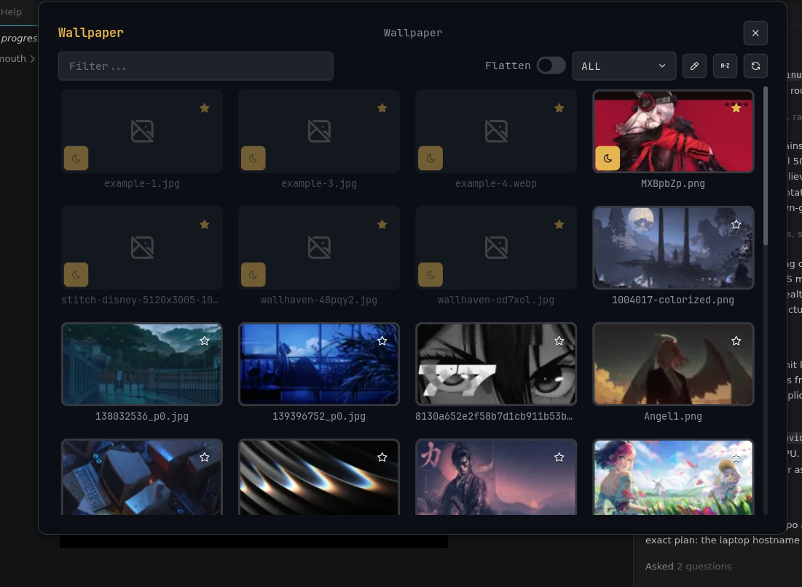

# Asura XS15 NixOS Flake

> [!WARNING]
> NixOS configuration for the Colorful XS 22 / X15 XS laptop. It is
> hardware-specific and optimized for a Hyprland/Noctalia workflow.

## Showcase

| Desktop Workspace | Lockscreen | Wallpaper Panel |
| :--- | :--- | :--- |
|  |  |  |

## Install

```bash
sudo git clone https://github.com/Valo-Asura/asura-xs15-nixos.git /etc/nixos
cd /etc/nixos
sudo nixos-generate-config --show-hardware-config > /etc/nixos/asura-xs15/system/hardware-configuration.nix
sudo nixos-rebuild switch --flake /etc/nixos#asura-xs15
```

The old `#nixos` flake output remains as a temporary compatibility alias, but
new commands should use `#asura-xs15`.

## Key Configurations

| Area | Current setup |
|---|---|
| Host | `asura-xs15` |
| Desktop | Hyprland `v0.55.3` from the official Hyprland flake plus Noctalia v5 shell |
| Lockscreen | Noctalia IPC lock using `screenshots/lockscreen.png`; Hyprlock removed |
| File manager | Nautilus, with `DBusActivatable=false` local desktop override |
| Theme | Dark GTK/libadwaita settings, Papirus-Dark icons, Bibata Classic cursor |
| Wallpaper | `SUPER+W` runs `asura-wallpaper-panel`, which opens Noctalia's wallpaper panel |
| Fan control | NBFC-Linux `0.5.2` plus NBFC-GTK `0.4.1` |
| Fan profile | Declarative two-fan `Colorful X15 AT 22` config with 8-bit `MaxSpeedValue = 255` |
| Plymouth | Local `circle_hud` theme from `asura-xs15/backup/plymouth/circle_hud` |
| Kernel | CachyOS `7.0.11` from `nix-cachyos-kernel/release` |
| Boot GPU policy | Intel `i915` loads in initrd; NVIDIA stays out of initrd and explicit `nvidia-drm.*` boot params |
| Power | `thermald` plus `tuned`; TLP disabled |
| Downloads | Xtreme Download Manager GTK `8.0.29` pre-release plus Firefox add-on and `xdm-app:` handlers |
| AI memory | Shared root at `/home/asura/.config/ai-unified-memory`; facts are system-only |

## Daily Commands

```bash
rebuild                       # fish alias for sudo nixos-rebuild switch --flake /etc/nixos#asura-xs15
nbfc-colorful-verify          # verify selected NBFC config, fan count, and registers
thermal-status                # temperatures, tuned/thermald/NBFC state
asura-dark-mode-refresh       # reapply GTK/libadwaita dark settings in the active session
asura-wallpaper-panel         # same wallpaper workflow as SUPER+W
```

## Repository Structure

```text
/etc/nixos
├── hosts/                  # Flake host declarations
├── system/                 # Thin shared NixOS defaults/import wrapper
├── asura-xs15/             # Laptop-specific declarative config
│   ├── backup/plymouth/    # Local Plymouth theme source
│   ├── hyprland/           # Nix-owned Hyprland config, rules, keybinds
│   ├── noctaliaShell/      # Noctalia settings and shell-managed app defaults
│   ├── scripts/            # Home Manager helper scripts
│   └── system/             # Flat one-file NixOS host modules
│       ├── default.nix
│       ├── boot.nix
│       ├── fan-control-tools.nix
│       ├── hardware.nix
│       ├── kernel-cachyos.nix
│       ├── packages.nix
│       ├── programs.nix
│       ├── services.nix
│       ├── theming.nix
│       └── users.nix
├── home/                   # Home Manager user configuration
├── docs/                   # Validation and workflow docs
└── screenshots/            # README screenshots
```

Rule: one-file modules stay as `.nix` files. Folders are only for real
multi-file domains such as `hyprland/`, `noctaliaShell/`, `scripts/`, and
`backup/plymouth/`.

## Docs

| Document | Purpose |
|---|---|
| [`docs/VALIDATION.md`](docs/VALIDATION.md) | Rebuild, fan, theme, and repo safety checks |
| [`docs/WALLPAPER.md`](docs/WALLPAPER.md) | `SUPER+W`, wallpaper paths, and fallback behavior |

## Previous Config References

The CachyOS backup used for this cleanup lives at:

```text
/home/asura/Downloads/colorfullxs15Previous
```

Important carry-overs:

- Colorful XS 22 / X15 XS hardware naming.
- NBFC profile `Colorful X15 AT 22`.
- True fan max is 8-bit `255`, not `100`.
- GPU fan registers are read `208`, write `232`.
- Live fan testing confirmed CPU reaches `100%` target. GPU accepts `100%`
  target, but its current-speed readback can stay negative/low on this EC, so
  use target speed plus airflow/noise for manual GPU fan confirmation.
- Nautilus is the intended file manager.
- CachyOS boot hangs were caused by forced early NVIDIA initramfs loading and
  explicit early DRM setup; this config keeps NVIDIA out of
  `boot.initrd.kernelModules` and removes local `nvidia-drm.*` boot params.
- Lockscreen, wallpaper, launcher, screenshots, clipboard, and session actions
  route through Noctalia IPC.
- Wofi and Hyprlock are not active modules.
- Chromium-family XDM integration uses the bundled extension folder at
  `/opt/xdman/chrome-extension`; Firefox gets the AMO add-on declaratively.

## Security Notes

This repo can contain personal system paths and encrypted SOPS files. Do not
commit raw secrets, API keys, `.env` files, browser profiles, SSH/GPG private
keys, age private keys, local memory databases, or tokens. Run the validation
grep in `docs/VALIDATION.md` before pushing.

The GitHub repo target is public:

```bash
gh repo create Valo-Asura/asura-xs15-nixos --public --source=/etc/nixos --remote=origin --push
```
