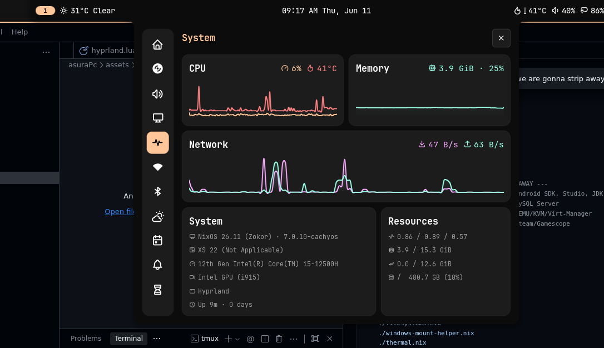
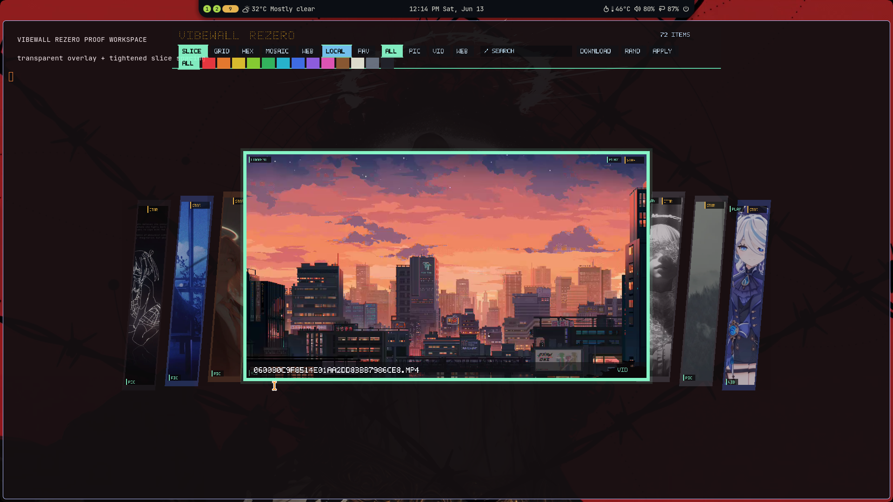

# Asura XS15 NixOS Flake

> [!WARNING]
> NixOS configuration for the Colorful XS 22 / X15 XS laptop. It is
> hardware-specific and optimized for a Hyprland/Noctalia workflow.

## Showcase

| Desktop Workspace | Lockscreen | Vibewall Grid |
| :--- | :--- | :--- |
|  |  |  |

| Vibewall Slice | Vibewall Hex | More/ehh image |
| :--- | :--- | :--- |
|  |  |  |

| Vibewall Mosaic | Wallhaven Browser |
| :--- | :--- |
|  |  |

| Transparent Active Workspace Overlay |
| :--- |
|  |

## Install

```bash
sudo git clone https://github.com/Valo-Asura/asura-xs15-nixos.git /etc/nixos
cd /etc/nixos
sudo nixos-generate-config --show-hardware-config > /etc/nixos/asura-xs15/system/hardware-configuration.nix
sudo nixos-rebuild switch --flake /etc/nixos#asura-xs15
```

The old `#nixos` flake output remains as a temporary compatibility alias, but
new commands should use `#asura-xs15`.

## Key Configurations

| Area | Current setup |
|---|---|
| Host | `asura-xs15` |
| Desktop | Hyprland `v0.55.3` from the official Hyprland flake plus Noctalia v5 shell |
| Lockscreen | Noctalia IPC lock using `screenshots/lockscreen.png`; |
| File manager | Nautilus, with `DBusActivatable=false` local desktop override |
| Theme | Dark GTK/libadwaita settings, Papirus-Dark icons, Bibata Modern Amber cursor at 24 px |
| Wallpaper | `SUPER+W` and `SUPER+SHIFT+W` open native `vibewallREzero`; images apply through Noctalia IPC, videos through `mpvpaper`, and video wallpaper is suspended on battery |
| Fan control | NBFC-Linux `0.5.2` plus NBFC-GTK `0.4.1` |
| Fan profile | Declarative two-fan `Colorful X15 AT 22` config with `MaxSpeedValue = 255`, max-sensor ramping, and emergency thermal guard |
| Plymouth | Local `circle_hud` theme from `asura-xs15/plymouth/circle_hud` |
| Kernel | CachyOS `7.0.11` from `nix-cachyos-kernel/release` |
| Boot GPU policy | Intel `i915` loads in initrd; NVIDIA stays out of initrd/modules-load and explicit `nvidia-drm.*` boot params |
| Performance | CachyOS kernel, `scx_lavd`, `ananicy-cpp` with CachyOS rules, BBR, zram, irqbalance, delayed NVIDIA persistenced, delayed cache warm, socket-activated VM stack |
| Power | `thermald` plus `tuned`; TLP disabled |
| Downloads | Xtreme Download Manager GTK `8.0.29` pre-release, user-session bridge, Firefox add-on, Chromium helper, and `xdm-app:` handlers |
| AI memory | Shared root at `/home/asura/.config/ai-unified-memory`; filesystem MCP is default, SQLite MCP is opt-in/lazy, facts are system-only |
| Codex | Declarative `pkgs.codex` plus generated GitHub/Notion plugin config after rebuild |

## Daily Commands

```bash
rebuild                       # fish alias for sudo nixos-rebuild switch --flake /etc/nixos#asura-xs15
nbfc-colorful-verify          # verify selected NBFC config, fan count, and registers
thermal-status                # temperatures, tuned/thermald/NBFC state
nbfc-gtk --fans               # launch GTK fan control UI
systemd-analyze blame         # inspect boot/app-start blockers
asura-dark-mode-refresh       # reapply GTK/libadwaita dark settings in the active session
vibewall scan                 # index /home/asura/Wallpaper images/videos and build thumbnails
vibewall toggle               # open/close the native picker used by SUPER+W
vibewall apply FILE           # apply an image via Noctalia or a video via mpvpaper
vibewall restore              # restore last wallpaper on Hyprland login
vibewall wallhaven search "anime landscape" --page 1
vibewall picker --wallhaven   # open cached Wallhaven browser directly
ai-memory-mcp-status          # show live AI memory MCP processes/RSS
ai-memory-mcp-stop            # stop current AI memory MCP workers
asura-ai-memory paths         # print shared memory + opt-in MCP config paths
asura-video-wallpaper-stop    # stop mpvpaper and clear video wallpaper state
```

## Repository Structure

```text
/etc/nixos
├── hosts/                  # Flake host declarations
├── system/                 # Thin shared NixOS defaults/import wrapper
├── asura-xs15/             # Laptop-specific declarative config
│   ├── plymouth/           # Local Plymouth theme source
│   ├── hyprland/           # Nix-owned Hyprland config, rules, keybinds
│   ├── noctaliaShell/      # Noctalia settings and shell-managed app defaults
│   ├── scripts/            # Home Manager helper scripts
│   ├── vibewallREzero/     # Native C++23 wallpaper picker/daemon package
│   └── system/             # Flat one-file NixOS host modules
│       ├── default.nix
│       ├── boot.nix
│       ├── fan-control-tools.nix
│       ├── hardware.nix
│       ├── kernel-cachyos.nix
│       ├── packages.nix
│       ├── programs.nix
│       ├── services.nix
│       ├── theming.nix
│       └── users.nix
├── home/                   # Home Manager user configuration
│   ├── application.nix     # Desktop entries, Nautilus, MIME defaults
│   ├── hyprland.nix        # Home Manager import for host Hyprland config
│   ├── theming.nix         # GTK/libadwaita/Qt dark theme and cursor
│   ├── aimemory.nix        # Shared system-scoped AI memory wiring
│   ├── default.nix         # Home Manager import root
│   ├── browser/
│   │   ├── brave.nix
│   │   ├── chrome.nix
│   │   ├── firefox.nix
│   │   └── helium.nix
│   ├── programs/
│   │   ├── git/
│   │   ├── neovim/
│   │   ├── scripts/
│   │   ├── terminal/
│   │   └── tmux/
│   ├── shell/
│   ├── templates/
│   └── vscode/
├── docs/                   # Validation and workflow docs
└── screenshots/            # README screenshots
```

Rule: one-file modules stay as `.nix` files. Folders are only for real
multi-file domains such as `hyprland/`, `noctaliaShell/`, `scripts/`,
`vibewallREzero/`, `browser/`, and `plymouth/`.

## Docs

| Document | Purpose |
|---|---|
| [`docs/VALIDATION.md`](docs/VALIDATION.md) | Rebuild, fan, theme, and repo safety checks |
| [`docs/WALLPAPER.md`](docs/WALLPAPER.md) | `SUPER+W`, vibewallREzero, Noctalia IPC image apply, and mpvpaper video apply |

## Previous Config References

The CachyOS backup originally used for this cleanup was expected at:

```text
/home/asura/Downloads/colorfullxs15Previous
```

On 2026-06-12 that path was not present locally, so the current tuning is based
on the durable CachyOS findings already captured in shared system memory plus
live `systemd-analyze` data from this NixOS boot.

Important carry-overs:

- Colorful XS 22 / X15 XS hardware naming.
- NBFC profile `Colorful X15 AT 22`.
- True fan max is 8-bit `255`, not `100`.
- GPU fan registers are read `208`, write `232`.
- NBFC must use the hottest CPU/GPU sensor (`TemperatureAlgorithmType = Max`)
  so short Alder Lake spikes ramp fans instead of being hidden by averaged
  sensors.
- Live fan testing confirmed CPU reaches `100%` target. GPU accepts `100%`
  target, but its current-speed readback can stay negative/low on this EC, so
  use target speed plus airflow/noise for manual GPU fan confirmation.
- Nautilus is the intended file manager.
- CachyOS boot hangs were caused by forced early NVIDIA initramfs loading and
  explicit early DRM setup; this config keeps NVIDIA out of
  `boot.initrd.kernelModules`, keeps NVIDIA out of systemd modules-load, and
  removes local `nvidia-drm.*` boot params.
- CachyOS-style responsiveness is declarative here: CachyOS kernel,
  `scx_lavd`, `ananicy-cpp` with CachyOS rules, `irqbalance`, BBR, zram, and
  TuneD profiles.
- AI memory MCP defaults are intentionally light: editor configs get the
  filesystem server only; SQLite MCP opt-in configs are generated under
  `/home/asura/.config/ai-unified-memory/mcp/`.
- Existing AI memory MCP workers can be reclaimed with `ai-memory-mcp-stop`.
- `nvidia-persistenced` remains available for NVML/monitoring, but starts from
  a delayed timer so it does not block `graphical.target`.
- `libvirtd`, `virtlogd`, and `virtlockd` are socket activated; VM tooling stays
  installed without starting the VM stack on every boot.
- Base BlueZ Bluetooth remains enabled, but Blueman's legacy tray/OBEX session
  stack is disabled because Noctalia owns the visible Bluetooth UI.
- `mpvpaper` video wallpaper is blocked/suspended on battery unless
  `ASURA_ALLOW_VIDEO_WALLPAPER_ON_BATTERY=1` is set for a manual run.
- Nix GC/optimise timers do not catch up missed daily runs at boot, avoiding
  I/O spikes during first login.
- Desktop cache warming is delayed and capped; it no longer reads package
  closures immediately after login.
- `vibewall toggle` starts the systemd user daemon first, so the first
  `SUPER+W` press opens the picker; clicking outside the centered stage closes
  it.
- Nautilus floats centered for quick file checks.
- XDM runs as a user session bridge and Brave/Chrome/Chromium launchers load
  `/opt/xdman/chrome-extension`; Firefox gets the AMO add-on declaratively.
- Codex plugin declarations live in the generated `~/.codex/config.toml` block
  so rebuilds keep GitHub/Notion plugins enabled.
- The `rescue-no-nvidia` boot specialization keeps the old rescue path
  declarative: multi-user target, Plymouth disabled, and temporary NVIDIA
  blacklist only for that entry.
- Lockscreen, wallpaper, launcher, screenshots, clipboard, and session actions
  route through Noctalia IPC.
- Wofi and Hyprlock are not active modules.
- Chromium-family XDM integration uses the bundled extension folder at
  `/opt/xdman/chrome-extension`, local desktop launchers add
  `--load-extension`, and Firefox gets the AMO add-on declaratively.

## Security Notes

This repo can contain personal system paths and encrypted SOPS files. Do not
commit raw secrets, API keys, `.env` files, browser profiles, SSH/GPG private
keys, age private keys, local memory databases, or tokens. Run the validation
grep in `docs/VALIDATION.md` before pushing.

The GitHub repo target is public:

```bash
gh repo create Valo-Asura/asura-xs15-nixos --public --source=/etc/nixos --remote=origin --push
```
